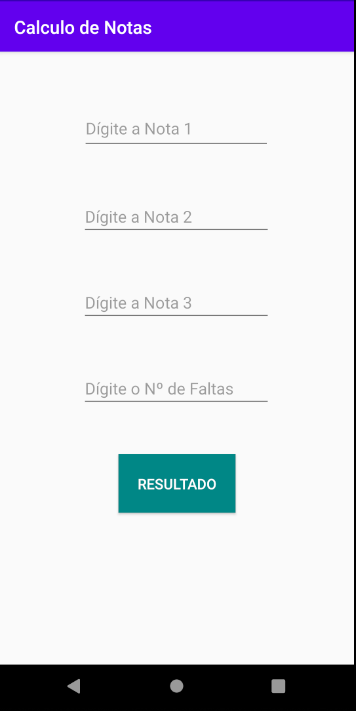

<h2>Calculo de Notas</h2>

Confira meu projeto de App de Cálculo de Notas Escolares criado com <strong>Android Studio</strong> e <strong>Kotlin</strong>! Esta aplicação permite calcular médias escolares de forma rápida e eficiente, levando em contas as faltas do aluno também. Com habilidades em desenvolvimento <strong>Android</strong> e a linguagem <strong>Kotlin</strong>, desenvolvi uma interface que permite inserir notas e obter o resultado instantaneamente. Este projeto é uma amostra do meu portfólio, destacando meu compromisso em criar soluções móveis úteis e práticas para o dia a dia.

